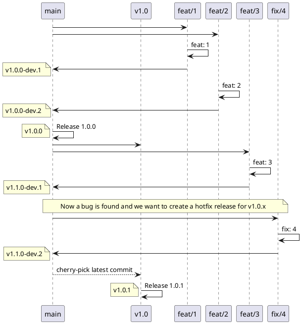

## Git organization

### Project naming

Projects are named using kebab-case

Naming:

[module]

Each project has its own `specs`.

Prefixes:

[topic]-[submodule]
dashboard-

### Branches

As a general rule, projects do have a long-lived, main branch where newest features are implemented. This branch is called _main_. 

This branch should be protected, in such a way that no direct commits or force pushes are allowed.

Every commit to main branch is supposed to contain an unstable but usable state, meaning by this that it should pass at least a minimal sanity test (it builds, contains appropriate formatting, passes unit tests, it is possible to deploy it to a test environment, etc.)

Besides main branch, we have two other branch types:

- Feature branches: usually created from main, these short-lived branches are meant to handle a new feature or fix that will be integrated into the origin branch. They are deleted as soon as this happens
- Maintenance branches: created when a new feature or fix must be integrated into a previously released line (e.g. 1.x when we are already working on 2.x). There is no need to create maintenance branch for every release, but only for those where a fix or feature is already scheduled. Later on, it can be reused for further minor releases if there is a need to do so

### Pull Request rules

The only way to commit into main branch is through a Pull Request that must be approved by another member of the team with right permissions.

Pull Requests (PR) must be named after their main purpose using semantic commit rules (e.g. 'feat: a new feature' or 'fix: an important bugfix'). When merging a Pull Request, all commits should be squashed into a single one whose message will be the same as PR's name. 

### Release strategy

As explained before, main branch should be in a state where it can be built and used but not necessarily be ready for production. So each commit on main branch might be considered as a new pre-release version. It is therefore possible to trigger, upon each commit into main branch, a CD stage that deploys it into a development environment, or publish it into development channels.

When the code in _main_ is considered to have reached a state where it is ready for a further stage, a Release must be created:

- If the code is going to a testing stage (staging) before going into production, the release must be marked as 'pre-release'. The release and its associated tag should trigger its deployment into staging environment (or publishing into staging channel)
- If the code has either passed the staging step or its policy does not include such intermediate testing stage, the release and its associated tag should trigger its deployment into production

We use semantic versioning to name the releases (X.Y.Z), where versions are upgraded as follows:

- Major: changes are significant, and/or breaking API changes are introduced
- Minor: there are changes in features that do not represent a breaking API change
- Patch: no new features. Bugfix only (not introducing any breaking API change)

These rules have particular meaning once the project has reached an initial 'official' release (i.e. 1.0.0). When it has been just started, some pre-releases with naming 0.X.Y could be delivered. In such case, we expect minor for breaking/significant changes and patch for both minor updates and fixes.

### Feature and fix workflow

Whenever new features are developed, feature branches from current state of `main` branch are created. These branches are meant to be short-lived and deleted as soon as they get merged into `main`. Naming for such branches follow the pattern `feat/description-of-the-feature`. It is encouraged to prefix the description with the number of the issue that originates it (if any).

Same considerations as before apply also for fixes, whose branches follow hte pattern `fix/description-of-the-fix`. However, there are some differences on the way they are integrated into codebase, especially when a release has been already done.

New features are always integrated into the mainline branch (`main`) and the same happens to the fixes. In case we want to backport a fix to a previously released version, we need to create a maintenance branch for it and cherry-pick the commits there.

For example, suppose the release 1.0.0 has been done and we already introduced breaking changes in `main`, so we are working on 2.0.0 pre-releases. During this time, a bug that affects also 1.0.0 is found and we want it to be fixed without waiting for 2.0.0 (or force users to upgrade). So the procedure is the following: 

- Create a `v1` maintenance branch from the commit tagged as `v1.0.0` (i.e. the one that produced the release)
- Create a fix branch from `main` to treat the issue, and merge it to `main` as well. 
- Perform a cherry-pick of that particular commit into `v1`
- Create a new release from new `v1` state and call it `v1.0.1` or `v1.1.0`, depending on the rules stated above

Note: there are some bugs that only affect previous versions (i.e. they are not present in `main` codebase). In such cases, it is fine to create the fix branch from maintenance branch (`v1` for this example).

