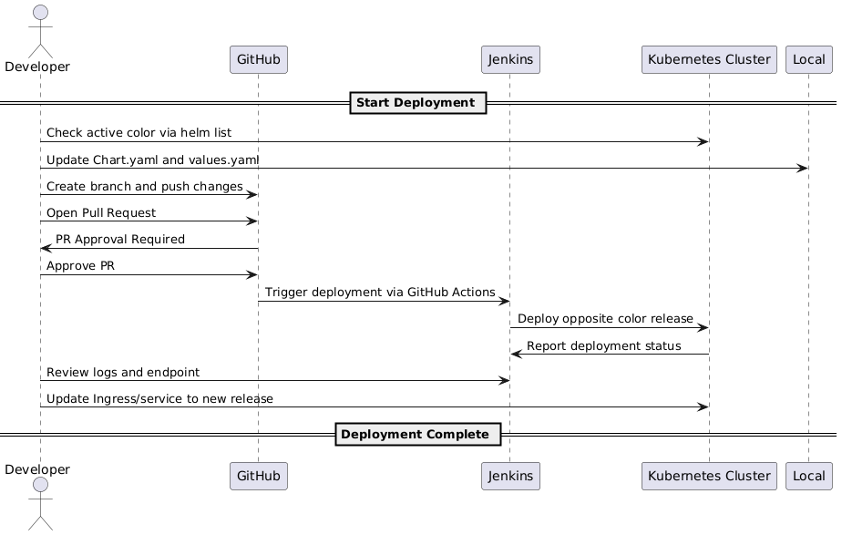

# 🚀 2060.io Deployment Strategy – Detailed Guide

This document describes the detailed procedure to deploy components of the **2060.io** infrastructure. It covers both automated deployments using **Jenkins with Blue-Green strategy** and manual deployments via **Helm**. The goal is to standardize and clarify every step to ensure safe and reliable deployments.

---

## 📦 Pre-requisites

Before starting any deployment, ensure the following:

### 🔐 Access Requirements

- Access to the relevant GitHub deployment repositories (e.g. [2060-core-deploy-dev])
- Access to the appropriate **Jenkins** instance (e.g. <https://jenkins.dev.2060.io>) with permissions to execute deployment jobs
- Access to **Kubernetes cluster**
- DockerHub read/push credentials (as needed)

### 💻 Tools Needed (Local Environment)

Only required for **manual Helm deployments**:

- `kubectl`
- `helm` v3+
- Valid `KUBECONFIG` file
- `git` (to fetch the latest deployment chart)

---

## 🔄 Blue-Green Deployment via Jenkins

This strategy allows you to deploy a new version in parallel ("blue" or "green") and switch traffic only when the deployment is verified.

### 📘 Naming Convention

All Helm releases **must be prefixed with `2060-`**, followed by the service name (which must match the folder name under `deployments/`) and the color suffix (either `-blue` or `-green`).

Example: `2060-webrtc-server-blue`

---

### 🔁 Deployment Workflow

Before starting, ensure that a Jenkins pipeline is already configured for the service you intend to deploy. Each service must have a corresponding job in Jenkins to execute the deployment process.

If your service does not yet have a pipeline, follow the steps in the [Create a New Pipeline](./README.md#5-create-a-new-pipeline) section of the Jenkins guide.



1. **Check the current live color**
   - Run `helm list -n <namespace>` or check Jenkins dashboard to see if `-blue` or `-green` is active

2. **Prepare changes**
   - Navigate to `deployments/<service-name>`
   - Update `Chart.yaml` with the new version and adjust `values.yaml` if needed

3. **Create a feature branch**

   ```bash
   git checkout -b feat/update-<service>-vX.Y.Z
   ```

4. **Commit your changes**

   ```bash
   git commit -am "feat: bump <service> to vX.Y.Z"
   ```

5. **Open a Pull Request to `main`**
   - Provide a meaningful title and description
   - Include release name and namespace for clarity

6. **After approval:**
   - GitHub Actions triggers Jenkins with the deployment parameters
   - Jenkins installs the new release with the opposite color (e.g., `green` if `blue` is active)

7. **Check Jenkins status**
   - Ensure the job completes successfully
   - Validate endpoint and logs for the new release

8. **Switch traffic**

   - Update Ingress or service selectors to route traffic to the new release.

   This step is triggered manually in Jenkins **only if the deployment stage completes successfully**:

   - In the classic Jenkins UI:  
     Scroll to the pipeline log and click the **"Approve and Switch Traffic"** button when prompted.  
     Alternatively, click **"Abort"** to cancel the switch if something needs to be reviewed.

   - In Blue Ocean:  
     Locate the `Switch Traffic` stage in the visual pipeline and click **"Approve and Switch Traffic"** to continue.

   This manual approval step will **not appear** if the pipeline fails before reaching the traffic switch stage.

---

## ⚙️ Manual Deployment via Helm

Manual deployments can be done directly using Helm when needed.

### ✅ Install a Service

```bash
helm upgrade --install 2060-<service>-<color> ./deployments/<service> --namespace <namespace>  --wait
```

Example:

```bash
helm upgrade --install 2060-webrtc-server-blue ./deployments/webrtc-server --namespace demos --wait
```

### 🧹 Uninstall a Service

```bash
helm uninstall 2060-<service>-<color> --namespace <namespace>
```

---

## 🧪 Post-Deployment Validation

1. Verify that pods are running:

   ```bash
   kubectl get pods -n <namespace>
   ```

2. Test service endpoints:
   - Use `kubectl port-forward`, or
   - Check configured domain via Ingress

3. View logs:

   ```bash
   kubectl logs <pod-name> -n <namespace>
   ```

4. Check ConfigMaps/Secrets mounting:

   ```bash
   kubectl describe pod <pod-name> -n <namespace>
   ```

---

## 🛠️ Common Troubleshooting

| Issue | Solution |
|-------|----------|
| Jenkins job fails | Verify webhook trigger and credentials |
| Helm error (conflict) | Ensure no existing release with same name |
| Pods crashloop | Inspect logs and environment configs |

---

## ✅ Best Practices Checklist

- [ ] All release names follow the format `2060-<service>-<blue|green>`
- [ ] Docker image is properly tagged and available in DockerHub
- [ ] `Chart.yaml` and `values.yaml` reflect the correct version and configuration
- [ ] A feature branch is created for every deployment change
- [ ] Pull Request clearly documents what is being deployed (version, namespace, service)
- [ ] Jenkins logs are reviewed after deployment
- [ ] Helm releases are cleaned up after switching production traffic
- [ ] Use `--wait` flag in Helm to ensure readiness before traffic switch (manual only)
- [ ] Keep Ingress and Service selectors aligned with active color deployment
- [ ] Monitor application after switch to detect regressions early

---

🎉 **Happy Deploying!**
